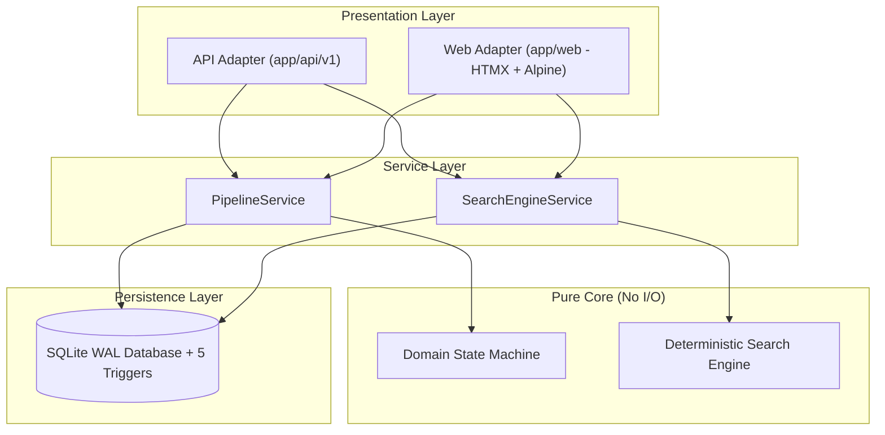

# Mini Hiring Pipeline

An API-first, event-sourced candidate tracking system featuring a deterministic natural language search engine, immutable audit logging, and a server-rendered HTMX+Alpine UI. For in-depth architectural details, database schema triggers, and design rationale, see [docs/ARCHITECTURE.md](file:///c:/Users/BIT/Desktop/Hiring%20Pipeline/mini-hiring-pipeline/docs/ARCHITECTURE.md).

---

## Quick Start

Prerequisites: Python 3.12+ and [uv](https://docs.astral.sh/uv/).

Run these **3 commands** to start the application:

```bash
uv sync
uv run python -m scripts.seed --reset
uv run uvicorn app.main:app
```

> **State:** No API keys or `.env` files are required.

Open your browser to:
- **Web App:** [http://127.0.0.1:8000](http://127.0.0.1:8000)
- **Interactive API Docs:** [http://127.0.0.1:8000/docs](http://127.0.0.1:8000/docs)

To run the complete test suite and quality gate checks:
```bash
uv run python -m scripts.check
```

---

## Try These Searches

The system includes a pre-seeded candidate dataset (`26 candidates`) with a deterministic natural-language search engine. Try typing these queries into the search bar:

| Query Type | Example Query | Expected Behavior & Matches (from `docs/SEED_DATA.md`) |
|---|---|---|
| **Exact Name** | `Find Priya Sharma` | 3 matches: **Priya Sharma** (1.0), **Priyanka Sharma** (0.99), **Riya Sharman** (0.91). Excludes low-scoring decoys (`Pria Verma` < 0.75). |
| **Typo Search** | `sharam` | 3 matches (1 edit budget): **Priya Sharma** (0.90), **Priyanka Sharma** (0.90), **Riya Sharman** (0.874). |
| **Current Stage** | `Who's in Interview right now?` | 4 active candidates in Interview: **Priya Sharma**, **Yash Chawla**, **Pooja Mishra**, **Kabir Bhatia**. Excludes rejected candidates. |
| **Stage Duration** | `Stuck in Screening for more than a week` | 3 candidates active in Screening > 7 days: **Rohan Mehta** (14d), **Kavya Reddy** (12d), **Aarav Patel** (10d). Excludes boundary candidate `Aditi Nair` (7.0d strict `gt`). |
| **Temporal Move** | `Who moved to Interview since Monday?` | 3 candidates moved since Monday 00:00 IST: **Priya Sharma**, **Divya Singh**, **Arjun Chatterjee**. |
| **Historical Stage** | `Who reached the Offer stage but didn't get hired?` | 3 candidates rejected at Offer: **Dhruv Kapoor**, **Tanya Saxena**, **Ishaan Malhotra**. Shows `INCLUDE_PENDING` hint for active offer candidates. |
| **Combo Query** | `priya moved to interview since monday` | 1 match: **Priya Sharma** (1.0). Combines name term and temporal movement filter. |
| **Invalid Stage** | `in onboarding` | **Error (`UNKNOWN_STAGE`):** `"'onboarding' isn't a stage. Stages are Applied, Screening, Interview, Offer, Hired."` |
| **Invalid Stuck** | `stuck in hired` | **Error (`FINAL_STAGE_STUCK`):** `"Hired is a final outcome — candidates can't be stuck there."` |

---

## Key Features

- **Event-Sourced Candidate Pipeline:** Tracks candidate progression across 5 linear stages (`Applied` $\rightarrow$ `Screening` $\rightarrow$ `Interview` $\rightarrow$ `Offer` $\rightarrow$ `Hired`) with 3 statuses (`active`, `hired`, `rejected`), live duration timers, and stage bitmasks.
- **Cryptographic Immutable Audit Trail:** Event store (`stage_events`) computes SHA-256 hash chains. Protected by 5 database triggers that block `UPDATE`, `DELETE`, or illegal stage transitions. Includes a live immutability verification demo script (`uv run python -m scripts.demo_immutability`).
- **Deterministic Natural Language Search Engine:** Fast (< 3 ms latency) in-memory rule parser, semantic AST validator, SQLAlchemy Core SQL compiler, tiered fuzzy name matcher, rank normalization, and counterfactual explanation generator (`EMPTY_RESULT` hints).

---

## Architecture at a Glance



Key highlights (see [docs/ARCHITECTURE.md](file:///c:/Users/BIT/Desktop/Hiring%20Pipeline/mini-hiring-pipeline/docs/ARCHITECTURE.md) for full design):
- **API-First Service Layer:** Decoupled business logic in `PipelineService` and `SearchEngineService`. Web UI and JSON API are thin presentation wrappers.
- **Pure Core Logic:** Core domain rules and search evaluation carry zero framework dependencies and no side effects.
- **Hardened Database Persistence:** SQLite WAL mode with `BEGIN IMMEDIATE` write transactions, optimistic concurrency, and 5 SQL triggers.
- **Modern HTMX UI:** Fast, reactive HTMX + Alpine.js server-rendered interface with top stage bar, stacked stage sections, and slide-over candidate detail drawer.
- **Zero-Regression Search Quality:** Evaluated against 55 test cases with 100% route accuracy, 100% AST accuracy, 90.4% clause F1, and sub-3ms latency.

---

## Architectural Decisions & Rationale

| Decision ID | Context & Decision | Why & Impact |
|---|---|---|
| **[D-001](file:///c:/Users/BIT/Desktop/Hiring%20Pipeline/mini-hiring-pipeline/docs/DECISIONS.md#d-001)** | **Server-rendered HTMX** instead of React. | Keeps 100% Python codebase with zero Node toolchain overhead. 3-command setup for reviewer. |
| **[D-002](file:///c:/Users/BIT/Desktop/Hiring%20Pipeline/mini-hiring-pipeline/docs/DECISIONS.md#d-002)** | **Hardened SQLite** (WAL mode, STRICT tables, 5 SQL triggers). | Zero-config database setup with DB-enforced immutability; fully portable to PostgreSQL. |
| **[D-003](file:///c:/Users/BIT/Desktop/Hiring%20Pipeline/mini-hiring-pipeline/docs/DECISIONS.md#d-003)** | **Planning docs git-ignored.** | Keeps repository clean and focused strictly on runnable application code and official documentation. |
| **[D-004](file:///c:/Users/BIT/Desktop/Hiring%20Pipeline/mini-hiring-pipeline/docs/DECISIONS.md#d-004)** | **StatusIs AST extended with `at_stage`.** | Supports queries like "rejected at Interview" natively without adding extra clause types. |
| **[D-005](file:///c:/Users/BIT/Desktop/Hiring%20Pipeline/mini-hiring-pipeline/docs/DECISIONS.md#d-005)** | **TimeInStage extended with `gte`/`lte`.** | Accurately differentiates "at least a week" ($\ge 7\text{d}$) from "more than a week" ($> 7\text{d}$). |
| **[D-006](file:///c:/Users/BIT/Desktop/Hiring%20Pipeline/mini-hiring-pipeline/docs/DECISIONS.md#d-006)** | **Rank-normalized scoring** ($1 - i/n$). | Disagreed with AI linear decrement formula ($1.0 - 0.1i$) which produced negative scores on $>10$ results. |
| **[D-007](file:///c:/Users/BIT/Desktop/Hiring%20Pipeline/mini-hiring-pipeline/docs/DECISIONS.md#d-007)** | **Top stage bar + stacked sections** UI layout. | 6 Kanban columns required horizontal scrolling below 1440px. Top stage bar provides clear progress and full card width. |
| **[D-008](file:///c:/Users/BIT/Desktop/Hiring%20Pipeline/mini-hiring-pipeline/docs/DECISIONS.md#d-008)** | **Cut LLM fallback & power tokens** under deadline. | Delivered 100% deterministic, zero-hallucination natural language search for all recruiter queries. |

---

## Quality & Evaluation Metrics

The repository enforces strict quality gates on every change via `uv run python -m scripts.check`:

- **Linting & Formatting:** `ruff check` and `ruff format` clean.
- **Type Safety:** `mypy --strict` clean across all source files.
- **Architectural Layering:** `import-linter` contracts verified (zero core I/O leaks).
- **Unit & Integration Tests:** **161 passed**, 8 skipped (eval queries cut per D-008).
- **Security Scanning:** Zero hardcoded secrets detected.
- **Search Evaluation Gate:** Offline search evaluation harness passing all targets:

| Metric | Measured Value (from `docs/EVAL_REPORT.md`) | Target / Status |
|---|---|---|
| **Evaluated Queries** | 47 / 55 (8 skipped per D-008) | PASS |
| **Route Accuracy** | **100.0%** | PASS (Target 100%) |
| **Exact-AST Match** | **100.0%** | PASS (Target 100%) |
| **Clause F1 Score** | **90.4%** | PASS (Target $\ge 85\%$) |
| **Error-Code Accuracy** | **100.0%** | PASS (Target 100%) |
| **Result Order Match** | **100.0%** | PASS (Target 100%) |
| **Latency p50 / p95** | **2.14 ms / 3.56 ms** | PASS (Target $< 30\text{ ms}$) |

For full benchmark breakdown by category, see [docs/EVAL_REPORT.md](file:///c:/Users/BIT/Desktop/Hiring%20Pipeline/mini-hiring-pipeline/docs/EVAL_REPORT.md).

---

## AI Assistance & Disagreements

This project was developed with AI pairing:
- **Design & Specification:** Claude 3.5 Sonnet (system architecture, state machine, search AST spec).
- **Implementation & Testing:** Antigravity agentic workflow (step-by-step coding, test suite, UI components, eval harness).
- **Logs & Decision Trail:** Complete transcripts recorded in [ai-logs/](file:///c:/Users/BIT/Desktop/Hiring%20Pipeline/mini-hiring-pipeline/ai-logs/) and key choices logged in [docs/DECISIONS.md](file:///c:/Users/BIT/Desktop/Hiring%20Pipeline/mini-hiring-pipeline/docs/DECISIONS.md).

> **Where I Disagreed with the AI (Decision D-006):**
> 
> The AI suggested scoring non-name search results by rank position using a linear decrement ($1.0, 0.9, 0.8, \dots$). On a query returning 19 candidates ("everyone except rejected"), this formula resulted in negative scores (down to $-0.8$), breaking the score bar UI element. I rejected the AI proposal, implemented rank normalization $\text{score} = 1 - i/n$, and proved with the oracle script that scores remain strictly within $(0, 1]$ (min $0.05$, max $1.0$).
> 
> Additional disagreements included **D-007** (replacing an unusable 6-column Kanban layout with a top stage bar) and HTMX attribute inheritance (diagnosing header pollution and forcing `htmx.config.disableInheritance = true`).

---

## Known Limitations

1. **Single Job & Single Recruiter:** System is designed for a single job position without multi-tenant authentication.
2. **LLM Fallback Cut (D-008):** Unrecognized natural language queries return `NOT_UNDERSTOOD` with an `LLM_UNAVAILABLE` warning seam rather than calling a remote model.
3. **Power Tokens Cut (D-008):** Syntactic search shortcuts (`stage:interview`, `days>=7`) are unparsed and fall back cleanly.

---

## Future Enhancements (With More Time)

1. **Saved Searches & SLA Alerts:** Candidate watchlists for candidates stuck in Screening $>7$ days with automated recruiter notification alerts.
2. **LLM Fallback Integration:** Enable the remote Gemini LLM fallback seam for complex, conversational edge queries.
3. **Multi-Job & Role-Based Auth:** Support multiple job requisitions with multi-recruiter permissions.
4. **PostgreSQL & Trigram Search:** Migrate persistence to PostgreSQL using `pg_trgm` inverted indexes for 1M+ candidate scale.

---

## Project Structure

```text
mini-hiring-pipeline/
├── app/
│   ├── api/             # API v1 REST endpoints (JSON presentation layer)
│   ├── core/            # Config, DB connection, clock, text utilities
│   ├── features/
│   │   ├── pipeline/    # Domain state machine, events, service, repo
│   │   └── search/      # Rule parser, AST validator, fuzzy ranker, service, repo
│   └── web/             # Server-rendered HTMX + Alpine UI (HTML presentation layer)
├── docs/                # Architecture, decisions, eval report, search spec, seed data
├── ai-logs/             # Transparent AI pair-programming transcripts and logs
├── migrations/          # Alembic DDL migrations & 5 database triggers
├── scripts/             # Seed database, immutability demo, eval harness, quality check
└── tests/               # Unit, integration, web, and evaluation test suites
```
