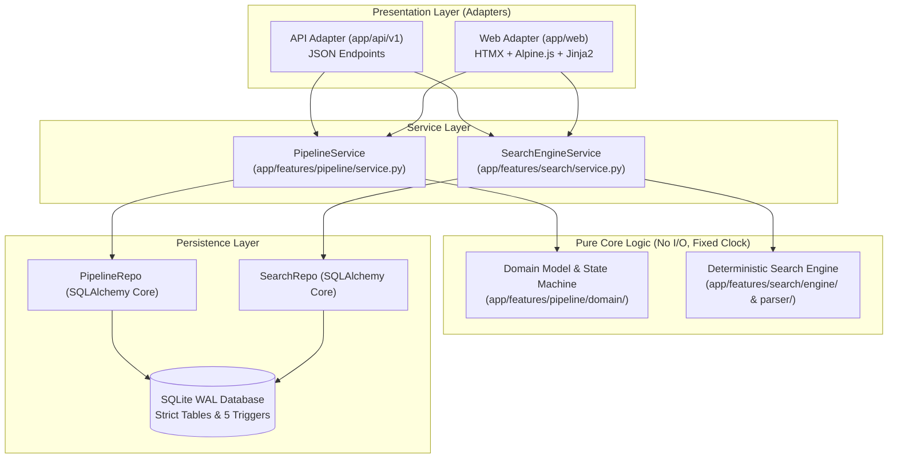

# Mini Hiring Pipeline — As-Built System Architecture

This document provides a comprehensive technical reference for the as-built architecture of the **Mini Hiring Pipeline** system. It reflects the exact state of the codebase in `app/`, `scripts/`, `tests/`, and `migrations/`.

---

## 1. System Overview & Architecture Diagram

The system is built as an **API-first, event-sourced candidate tracking and deterministic search platform**. It follows a strict separation of concerns: core domain logic and search evaluation are 100% pure Python with zero I/O or framework dependencies.



### Key Architectural Boundaries
- **API-First Core:** `app/api/v1` and `app/web` are thin adapters over `PipelineService` and `SearchEngineService`. API and Web adapters never import each other.
- **Pure Core:** `app/features/pipeline/domain/`, `app/features/search/parser/`, and `app/features/search/engine/` contain zero I/O, no framework imports, and no `datetime.now()` calls. All time operations use an injected `Clock` protocol.
- **Repository Isolation:** Only `repo.py` modules execute SQL queries. Only `service.py` modules invoke repositories.

---

## 2. Domain Model & State Machine

The recruitment pipeline models candidate progression through five linear stages and three statuses.

### Stages & Statuses
- **Stages:** `Applied` (1), `Screening` (2), `Interview` (3), `Offer` (4), `Hired` (5).
- **Statuses:** `active`, `hired`, `rejected`.

### Transition Matrix

| Action | Current Stage | Target Stage | New Status | Rules & Constraints |
|---|---|---|---|---|
| **`CREATE`** | None | `Applied` | `active` | Initial candidate creation. Sequence number `seq = 1`. |
| **`ADVANCE`** | `Applied` | `Screening` | `active` | Forward move by 1 stage. `seq = seq + 1`. |
| **`ADVANCE`** | `Screening` | `Interview` | `active` | Forward move by 1 stage. `seq = seq + 1`. |
| **`ADVANCE`** | `Interview` | `Offer` | `active` | Forward move by 1 stage. `seq = seq + 1`. |
| **`ADVANCE`** | `Offer` | `Hired` | `hired` | Forward move to terminal stage. `status` becomes `hired`. |
| **`REJECT`** | Any active stage | None | `rejected` | Candidates remain at their rejected-from stage; `status` becomes `rejected`. |
| **`NOTE`** | Any | Any | Unchanged | Appends an annotation event. Does not alter `stage`, `status`, or `version`. |

### Stage Bitmask (`reached_mask`)
To efficiently query candidate history (e.g. "Who reached Offer stage?"), `candidate_state` stores an integer bitmask (`reached_mask`):
- `Applied` = 1 ($2^0$)
- `Screening` = 2 ($2^1$)
- `Interview` = 4 ($2^2$)
- `Offer` = 8 ($2^3$)
- `Hired` = 16 ($2^4$)

A candidate who reached Offer stage has `reached_mask` $= 1 + 2 + 4 + 8 = 15$. SQL filter: `(reached_mask & :bit) != 0`.

---

## 3. Data Model & Schema Enforcement

Persistence is provided by SQLite in `STRICT` mode via SQLAlchemy Core and Alembic (`migrations/versions/0001_initial.py`).

### Relational Tables

1. **`candidates`**: Primary candidate identity table.
   - `id`: ULID string (26 chars, `PRIMARY KEY`).
   - `full_name`: String (1–100 chars).
   - `name_normalized`: Lowercase normalized full name for exact/prefix matching.
   - `email`: Optional email string (max 254 chars, `UNIQUE`).
   - `created_at`: Unix timestamp in milliseconds.

2. **`stage_events`**: Immutable event store.
   - `id`: ULID string (`PRIMARY KEY`).
   - `candidate_id`: ULID (`FOREIGN KEY -> candidates.id`).
   - `seq`: Integer sequence number per candidate (`seq >= 1`). `UNIQUE(candidate_id, seq)`.
   - `type`: ENUM (`'CREATED'`, `'ADVANCED'`, `'REJECTED'`, `'NOTE'`).
   - `from_stage`, `to_stage`: ENUM (`'Applied'`, `'Screening'`, `'Interview'`, `'Offer'`, `'Hired'`).
   - `occurred_at`: Unix timestamp in milliseconds.
   - `actor`: String (default `'recruiter'`).
   - `note`: Optional text (max 500 chars).
   - `prev_hash`: Hash of preceding event in chain (`NULL` for `seq=1`).
   - `hash`: SHA-256 hash string (`NOT NULL`).

3. **`candidate_state`**: Read model state projection.
   - `candidate_id`: ULID (`PRIMARY KEY REFERENCES candidates.id`).
   - `stage`: Current stage ENUM (`'Applied'`, `'Screening'`, `'Interview'`, `'Offer'`, `'Hired'`).
   - `status`: Current status ENUM (`'active'`, `'hired'`, `'rejected'`).
   - `stage_entered_at`: Unix timestamp when current stage was entered.
   - `version`: Latest event sequence number (`version >= 1`).
   - `reached_mask`: Bitmask of all stages reached (`1` to `31`).
   - `last_event_at`: Unix timestamp of latest event.

### Database Triggers (5 Active Triggers)
The database enforces immutability and state transition rules via 5 SQL triggers:
1. `stage_events_no_update`: Blocks `UPDATE` statements on `stage_events` (`RAISE(ABORT, 'stage_events is append-only')`).
2. `stage_events_no_delete`: Blocks `DELETE` statements on `stage_events` (`RAISE(ABORT, 'stage_events is append-only')`).
3. `candidates_no_update`: Blocks `UPDATE` statements on `candidates` (`RAISE(ABORT, 'candidates are immutable; add a NOTE instead')`).
4. `candidates_no_delete`: Blocks `DELETE` statements on `candidates` (`RAISE(ABORT, 'candidates cannot be deleted')`).
5. `stage_events_guard_transition`: `BEFORE INSERT` guard on `stage_events` for `ADVANCED` and `REJECTED` types. Validates that `candidate_state` contains matching `candidate_id`, `status = 'active'`, `stage = NEW.from_stage`, and `version = NEW.seq - 1`.

---

## 4. Transactions, Concurrency, and Event-Sourcing

### SQLite WAL Mode & `BEGIN IMMEDIATE`
Database connections run in Write-Ahead Logging (WAL) mode (`PRAGMA journal_mode=WAL;`). All write transactions use `BEGIN IMMEDIATE` via the `write_tx()` context manager in `app/core/db.py`. This acquires a reserved lock immediately upon transaction start, preventing write skew and `SQLITE_BUSY` deadlocks under concurrent access.

### Append-Before-Project Pattern
State mutations follow a strict event-sourcing append-before-project workflow inside a single `BEGIN IMMEDIATE` transaction:
1. Fetch current `candidate_state` row.
2. Verify optimistic concurrency version (`expected_version == state.version`).
3. Compute event SHA-256 hash incorporating `prev_hash`.
4. `INSERT` new event into `stage_events`. (DB trigger `stage_events_guard_transition` executes here).
5. Update `candidate_state` projection table.
6. Commit transaction.

### The Concurrency & Integrity Triple-Guard
State integrity is guaranteed by three independent safety guards:
1. **Application Optimistic Concurrency:** `expected_version` validation in `PipelineService`.
2. **Database Trigger Verification:** `stage_events_guard_transition` validates current state and sequence alignment before event insertion.
3. **Database Uniqueness Constraint:** `UNIQUE(candidate_id, seq)` constraint on `stage_events`.

---

## 5. Audit Trail & Immutability Verification

### SHA-256 Cryptographic Hash Chain
Every event inserted into `stage_events` contains a cryptographic digest computed as:
$$\text{hash} = \text{SHA256}(\text{candidate\_id} \parallel \text{seq} \parallel \text{type} \parallel \text{from\_stage} \parallel \text{to\_stage} \parallel \text{occurred\_at} \parallel \text{actor} \parallel \text{note} \parallel \text{prev\_hash})$$

### Verification Service
`PipelineService.verify(candidate_id)` recalculates the entire hash chain from genesis (`seq = 1`) to the latest sequence number, verifying that no historical events have been tampered with or modified.

### Immutability Verification Command
The immutability guarantee can be verified live using the demonstration script:
```bash
uv run python -m scripts.demo_immutability
```
This script executes raw SQLite queries attempting four illegal operations (`UPDATE stage_events`, `DELETE stage_events`, `UPDATE candidates`, and illegal stage jump `Applied -> Interview`), confirming that all four are rejected by database triggers while candidate history remains 100% verified.

---

## 6. Search Pipeline Architecture

The deterministic search engine parses natural-language recruiter queries into a structured AST, validates semantics, compiles SQL queries, applies fuzzy ranking, and generates human-readable explanations.

```
Query String → [Normalizer] → [Rule Parser] → [Query AST] → [AST Validator] → [SQL Compiler] → [Fuzzy Ranker] → [Explanation Engine] → Results
```

### 1. Normalization & Lexicon Tokenization
- Lowercases input, strips punctuation, and standardizes spacing.
- Enforces a 200-character limit (returns HTTP 400 `QUERY_TOO_LONG` if exceeded).

### 2. Rule Parser & AST Generation
- Parses natural language phrases into AST clauses (e.g. `CurrentStage`, `StatusIs`, `MovedTo`, `TimeInStage`, `Reached`, `Added`, `NameTerm`).
- Resolves relative temporal queries ("since Monday", "this week") using the recruiter's configured timezone (`Asia/Kolkata`).

### 3. AST Validator & Error Catalog
Validates semantic correctness before SQL execution. If invalid, returns structured error codes:
- `UNKNOWN_STAGE`: Query references invalid stage name (e.g., "in onboarding").
- `FINAL_STAGE_STUCK`: Query specifies stuck in Hired (Hired is terminal).
- `START_STAGE_MOVE`: Query specifies moved to Applied (everyone starts in Applied).
- `CONTRADICTION`: Conflicting stage clauses (e.g., "in Interview and in Offer").
- `INVALID_REJECT_STAGE`: Invalid rejection stage combination.
- `QUERY_TOO_LONG`: Query exceeds 200 characters.
- `NOT_UNDERSTOOD`: Unrecognized query grammar (emits `LLM_UNAVAILABLE` warning seam).

### 4. Tiered Fuzzy Scoring & Name Matching
Name matching in `app/features/search/engine/fuzzy.py` scores candidate names against query terms:
- **Exact Match:** Term matches token exactly $\rightarrow S = 1.0$.
- **Prefix Match:** Token starts with term (length $\ge 2$) $\rightarrow S = 0.92$.
- **Fuzzy Distance:** Edit distance within edit budget $\rightarrow S = 0.90 \times \max(\text{Damerau-Levenshtein Normalized}, \text{Jaro-Winkler})$.
  - Edit budget: term length $\le 4 \rightarrow 1$ edit; $5\text{--}8 \rightarrow 2$ edits; $> 8 \rightarrow 3$ edits.
- **Name Threshold:** Candidate name terms must score $\ge 0.75$ to be included.
- **Order Bonus:** $+0.03$ bonus applied if query terms match candidate name tokens in left-to-right order (capped at $1.0$).

### 5. Non-Name Query Ranking (Decision D-006)
For non-name queries (e.g., "everyone except rejected"), candidates are scored using rank normalization:
$$\text{score} = \text{round}\left(1.0 - \frac{i}{n}, 2\right)$$
where $i$ is the candidate's 0-indexed position and $n$ is total result count. This guarantees all scores remain strictly within $(0, 1]$ regardless of result volume (avoiding negative scores from linear rank decrements).

### 6. `EMPTY_RESULT` Counterfactual Explanations
When a valid multi-clause query yields zero matching candidates, the engine performs counterfactual analysis: it re-evaluates the query dropping each clause independently, producing actionable hints (e.g., `"No one matches all 2 conditions. Without 'added this week' there would be 4."`).

---

## 7. User Interface (UI Architecture)

The web user interface (`app/web`) is server-rendered using Jinja2 templates, HTMX, Alpine.js, and Vanilla CSS tokens (`app/web/static/css/app.css`).

### Top Stage Bar & Grouped "All" View (Decision D-007)
- **Top Stage Bar:** Displays stage buttons (`All`, `Applied`, `Screening`, `Interview`, `Offer`, `Hired`, `Rejected`) with live candidate counts.
- **Grouped All View:** Defaults to displaying candidate cards grouped in vertically stacked stage sections, preserving full visibility without requiring horizontal scrolling.
- **Rejected Distinction:** `Rejected` is rendered separately as a status filter, reflecting that rejection is a status rather than an active stage.

### Candidate Detail Drawer
- Slide-over `<aside>` element on the right of the viewport.
- Fetched on-demand via HTMX (`GET /ui/drawer/{candidate_id}`).
- Renders live stage duration timers, audit history timelines, SHA-256 verification badges (`Verified`), and interactive note submission.

### HTMX & Alpine.js Content Security Policy (CSP) Decisions
- **`disableInheritance`:** Configured `htmx.config.disableInheritance = true` to prevent HTMX parent attributes from leaking into drawer sub-requests.
- **Explicit Targets:** All HTMX elements specify explicit `hx-target` (e.g., `hx-target="#drawer-container"`) and `hx-swap` behavior.
- **Strict CSP Enforcement:** Middleware enforces nonced scripts (`script-src 'self' 'nonce-...'`), disables inline `<script>` tags, and forbids inline `style="..."` attributes.

---

## 8. Security, Testing & Quality Assurance

### Security Implementation
- **SQL Injection Prevention:** 100% parameter-bound queries via SQLAlchemy Core. No raw SQL string formatting.
- **XSS Prevention:** HTML Jinja autoescaping enabled globally; strict CSP headers.
- **CSRF Protection:** Double-submit cookie CSRF middleware protecting all state-changing POST endpoints (`/api/v1/...` and `/ui/...`).
- **PII & Secret Protection:** Zero logging of candidate names, emails, or raw search queries. Secrets scanning verified by quality gate.

### Testing Strategy
- **Framework:** `pytest` test suite with 161 passed tests and 8 skipped tests (eval queries cut under D-008).
- **Determinism:** Tests run against fixed clock (`FixedClock`) and isolated SQLite in-memory/file databases with zero network access.
- **Import Linter:** Enforces strict boundary contracts (e.g. pure core does not import I/O; `pipeline` does not depend on `search`).

### Offline Search Evaluation Harness
The offline search evaluation suite (`scripts/eval.py`) validates search quality across 55 test cases:
- **Route Accuracy:** 100.0%
- **Exact-AST Match:** 100.0%
- **Clause Precision / Recall / F1:** 90.4% / 90.4% / 90.4%
- **Error-Code Accuracy:** 100.0%
- **Result Keys Exact Order Match:** 100.0%
- **Latency (p50 / p95):** 2.14 ms / 3.56 ms

---

## 9. As-Built vs. Original Design Comparison

| Component / Feature | Original Design (SYSTEM_DESIGN.md) | As-Built Implementation (Codebase) | Rationale & Impact |
|---|---|---|---|
| **Pipeline UI View** | Six side-by-side Kanban columns | Top stage bar + stacked stage sections ("All" view) | **D-007:** Kanban columns required horizontal scrolling below 1440px. Top stage bar provides clear progress and full card width. |
| **Candidate Detail UI** | Native `<dialog>` modal popup | Slide-over `<aside>` drawer element | Better usability on desktop viewports; allows viewing board context while reviewing candidate timeline. |
| **Search Engine Fallback** | Gemini LLM fallback for unclear queries | Deterministic rule parser only (LLM fallback cut) | **D-008:** LLM fallback cut under time constraints. Engine returns `NOT_UNDERSTOOD` with an `LLM_UNAVAILABLE` warning seam. |
| **Power Search Tokens** | Power search syntax (`stage:interview`, `days>=7`) | Feature cut (unrecognized tokens fall back cleanly) | **D-008:** Cut under time constraints to focus on complete, 100% accurate recruiter natural language queries. |
| **Board API JSON Keys** | PascalCase keys (`Applied`, `Screening`, etc.) | Lowercase keys (`applied`, `screening`, `interview`, `offer`, `hired`, `rejected`) | Standardized JSON naming conventions across REST API payloads. |
| **Over-Long Query Handling** | Truncate query string | HTTP 400 Bad Request (`QUERY_TOO_LONG`) | Prevents unexpected partial parser behavior on malformed inputs exceeding 200 characters. |
| **Non-Name Result Scoring** | Decrement score by 0.1 per rank position | Rank-normalized scoring $1.0 - i/n$ | **D-006:** Fixed bug where rank decrement produced negative scores (e.g. $-0.8$) on queries returning $> 10$ candidates. |
| **StatusIs AST Clause** | Simple `status` field only | Extended with `at_stage` parameter | **D-004:** Enables structured search for "rejected at Interview" without introducing a separate clause type. |
| **TimeInStage Operators** | `gt` and `lt` operators only | Extended with `gte` and `lte` operators | **D-005:** Allows precise differentiation between "more than a week" ($> 7\text{d}$) and "at least a week" ($\ge 7\text{d}$). |
